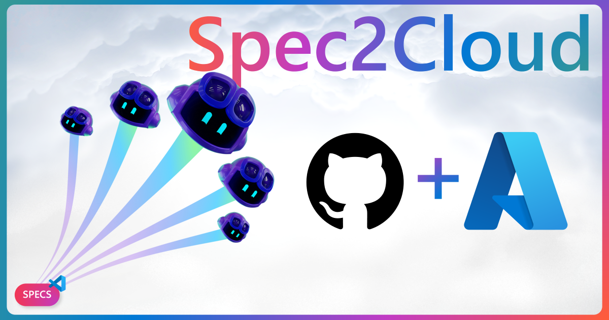

# Spec2Cloud Toolkit for VS Code



Discover, browse, and use Azure specification templates for your projects with this comprehensive VS Code extension. Powered by the [Azure-Samples/Spec2Cloud](https://github.com/Azure-Samples/Spec2Cloud) repository.

## Features

### 🎨 Gallery View

Browse templates with a beautiful gallery interface featuring:
- Full-featured template cards with thumbnails
- Real-time search across all template properties
- Multiple filter options (category, industry, services, languages, frameworks)
- Sorting by name or date
- Video previews and detailed information modals


### 📋 Templates Tree View

Quick access to templates in a hierarchical view:
- Sort by name (A-Z/Z-A) or date (newest/oldest)
- View template details on GitHub
- One-click template usage
- Refresh to get latest templates

### 📚 Resources View

Configurable quick links to documentation and helpful resources.

### 🤖 MCP Tool Support

Provides tools to find templates and estimate costs on Azure.

## Getting Started

1. **Install the Extension**
   - Install from VS Code Marketplace or VSIX file

2. **Open Spec2Cloud**
   - Click the Spec2Cloud icon in the Activity Bar
   - Browse the gallery or use the tree view

3. **Find Templates**
   - Search by keywords, services, languages, or frameworks
   - Use filters to narrow down options
   - Watch demo videos to preview templates

4. **Use a Template**
   - Click "Use Template" on any template
   - Confirm to download all files to your workspace
   - Existing files are never overwritten

## Configuration

### Templates Repository

Configure the GitHub repository containing templates:

```json
{
  "spec2cloud.templatesRepo": "https://github.com/Azure-Samples/Spec2Cloud"
}
```

### Custom Resources

Add your own resource links:

```json
{
  "spec2cloud.resources": [
    {
      "name": "Azure Documentation",
      "description": "Official Azure docs",
      "url": "https://learn.microsoft.com/azure",
      "icon": "Azure"
    }
  ]
}
```

## Commands

| Command | Description |
|---------|-------------|
| `spec2cloud.openGallery` | Open the template gallery |
| `spec2cloud.refreshTemplates` | Refresh templates from repository |
| `spec2cloud.sortTemplatesByName` | Toggle name sorting (A-Z/Z-A) |
| `spec2cloud.sortTemplatesByDate` | Toggle date sorting (newest/oldest) |
| `spec2cloud.viewTemplateOnGitHub` | Open template on GitHub |
| `spec2cloud.viewTemplateInGallery` | View template in gallery |
| `spec2cloud.initializeTemplate` | Initialize template to workspace |

## Template Structure

Templates in the repository should follow this structure:

```
template-name/
├── README.md
├── thumbnail.png (16:9 aspect ratio)
├── demo.mp4 (optional)
└── ... (template files)
```

The repository must include a `templates.json` file:

```json
{
  "templates": [
    {
      "name": "template-folder-name",
      "title": "Template Display Name",
      "description": "Template description",
      "category": "AI Apps",
      "industry": "Healthcare",
      "thumbnail": "thumbnail.png",
      "video": "demo.mp4",
      "services": ["Azure OpenAI", "Azure Cosmos DB"],
      "languages": ["Python", "TypeScript"],
      "frameworks": ["LangChain"],
      "tags": ["chat", "rag"],
      "authors": [
        {
          "name": "Author Name",
          "githubHandle": "githubusername"
        }
      ],
      "version": "1.0.0",
      "lastCommitDate": "2025-11-12"
    }
  ]
}
```

## Icons

The extension includes SVG icons for:
- **60+ Azure Services** (blue badges)
- **5 Programming Languages** (orange badges)
- **4 Frameworks** (purple badges)

Icons are located in:
- `resources/services/`
- `resources/languages/`
- `resources/frameworks/`

## Requirements

- VS Code 1.105.0 or later
- Internet connection to fetch templates

## Extension Settings

| Setting | Default | Description |
|---------|---------|-------------|
| `spec2cloud.templatesRepo` | `https://github.com/Azure-Samples/Spec2Cloud` | GitHub repository URL |
| `spec2cloud.resources` | `[...]` | Custom resource links |

## Known Issues

- Template downloads require internet connection
- Large templates may take time to download
- Private repositories require authentication (not yet supported)

See [TROUBLESHOOTING.md](TROUBLESHOOTING.md) for solutions to common issues.

## Documentation

- [User Guide](USER_GUIDE.md) - Comprehensive usage documentation
- [Troubleshooting](TROUBLESHOOTING.md) - Solutions to common problems
- [Templates JSON Format](TEMPLATES_JSON_FORMAT.md) - Template repository format
- [MCP Tools](MCP_TOOLS.md) - MCP tool integration details
- [Testing Guide](TESTING.md) - Extension testing instructions
- [Contributing](CONTRIBUTING.md) - Contribution guidelines

## Release Notes

### 0.6.2

See [CHANGELOG.md](CHANGELOG.md) for full release notes.

**Latest Features:**
- 🤖 **GitHub Copilot Integration**: `@spec2cloud` chat participant and language model tools
- 💰 **Azure Cost Estimator**: Real-time pricing from Azure Retail Prices API
- 🔗 **URI Protocol Handler**: Open templates via `vscode://` protocol
- 📋 **Git Clone Integration**: Templates cloned directly using `git clone`
- 🎨 Modern UI with theme support (light/dark)
- 🔍 Powerful search across all template properties
- 🏷️ Multiple filter dimensions (category, industry, technology)
- 📊 Flexible sorting (name, date)
- 🎬 Video previews for templates
- 📱 Responsive gallery layout
- 🔒 Safe template downloads (no overwrites)

## License

[MIT](LICENSE)

## Acknowledgments

- Template repository: [Azure-Samples/Spec2Cloud](https://github.com/Azure-Samples/Spec2Cloud)
- Azure icons and branding: Microsoft Corporation
- Built with ❤️ for the Azure community

---

**Enjoy building with Spec2Cloud templates!** 🚀
